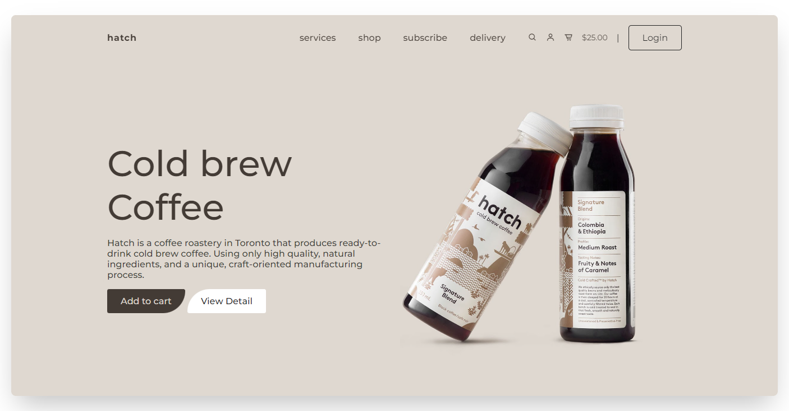
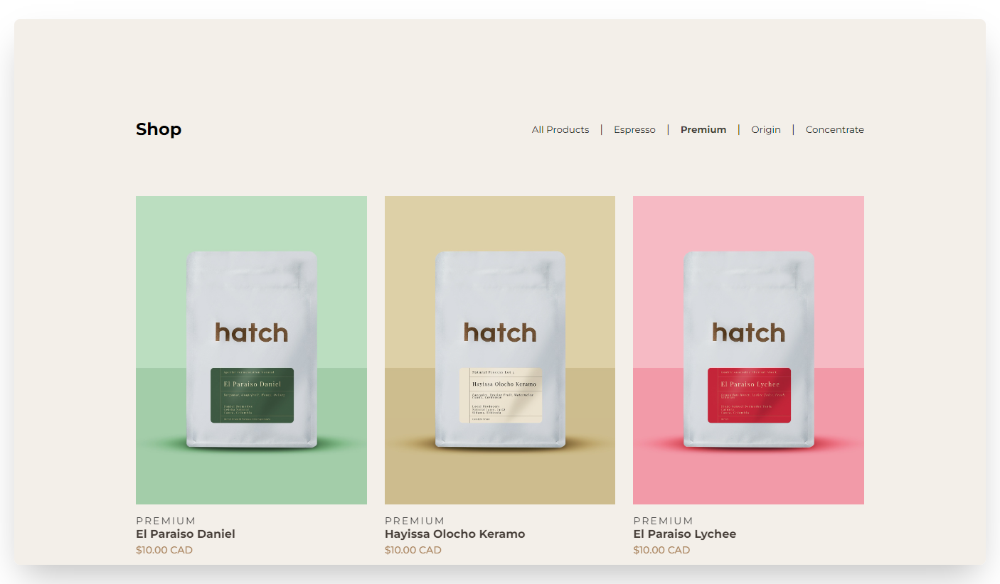
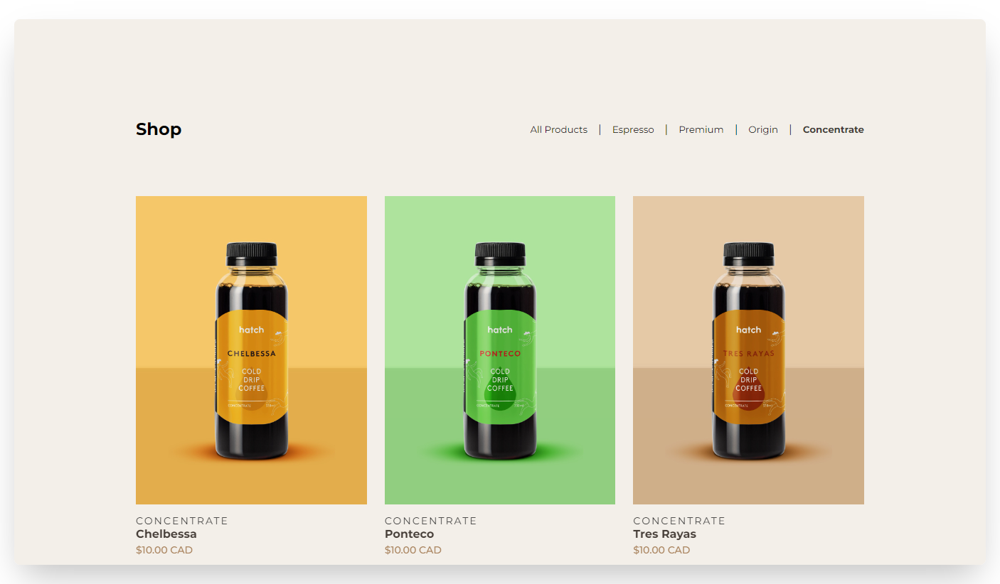
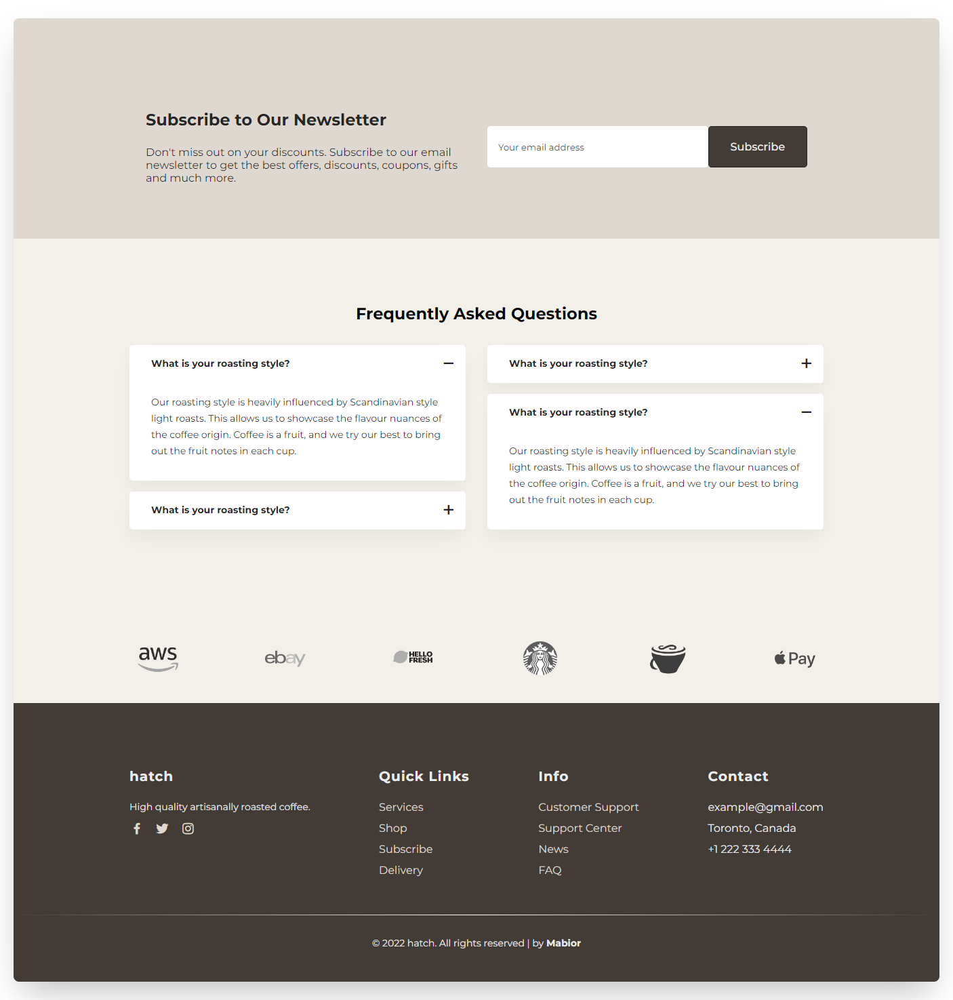

  
  
  
  
  
  
  <h2 align="center">hatch - A coffee roastery in Toronto that produces ready-to-drink cold brew coffee.</h2>

  Redesigned the hatch website to showcase my front-end skills. Built this for educational purposes only.

  <a href="https://universeglance.netlify.app/"><strong>➥ Live Demo</strong></a>

### Preview

### Overview
- Developed using Mobile First Approach.
- Responsive on all devices.
- SEO optimized.

### Tools Used
- Icons: https://boxicons.com/
- Images: https://www.hatchcrafted.com/

### Built With
- HTML5
- CSS3
- Javascript

### Feedback
- If you have any feedback, please reach out to me at mabiorduom5@gmail.com